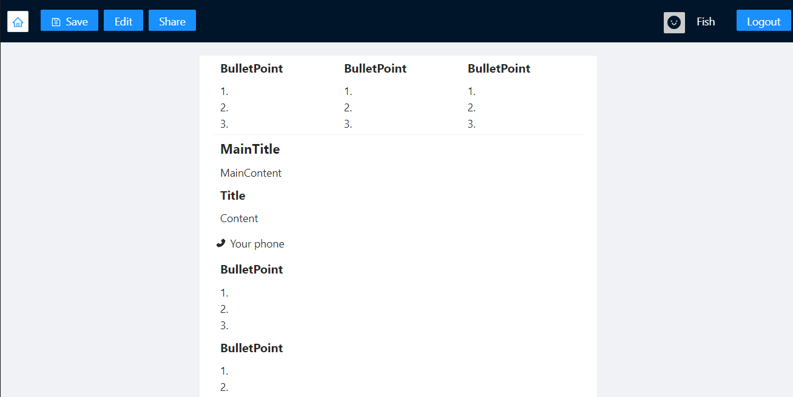

# ResuMaker
## Project Preview
### Home Page
<a href="https://youtu.be/R3rLPsVxOU8"></a>

### Resume Page
<a href="https://youtu.be/R3rLPsVxOU8"></a>

## Introduction
ResuMaker is a web application designed to assist job seekers in creating their own resumes. Our platform provides a vast array of templates, empowering users to tailor their resumes according to their needs. Additionally, we've implemented a share feature that allows users to share their resumes with potential employers. Our primary mission with ResuMaker is to simplify the job application process, thereby helping users secure their dream jobs effortlessly.

[Introduction Video (Mandarin)](https://youtu.be/R3rLPsVxOU8)

## Application Workflow
1. Edit the resume 
2. Save the resume
3. Share the resume

## Environment
Node.js@14.x.x

## Execution

Follow the steps below to run the project on your local machine.

1. First, head to `./frontend` and `./backend` directories to initiate the package installation process.
```bash
cd frontend && yarn
cd backend && yarn
```

2. Next, set up a MongoDB URL and insert it into `./backend/.env`:
```
MONGO_URL=mongodb+srv://....
PORT=5000
```

3. Lastly, open two separate terminals to execute `yarn start` and `yarn server` separately.
```bash
cd frontend && yarn start
cd backend && yarn server
```

## Features
### Backend
We've established a login system leveraging cookie and session methodologies, enhanced by `passport.js` and `express-session.js` for streamlined execution. Whenever a new client connects, the server initiates a session and sets up cookies in the client's browser. This setup enables the server to recognize the client during future communications.

### Frontend
When a client logs in successfully, the browser sets an 'isLogin' cookie, allowing React to maintain login status even after a page refresh. Altering this cookie won't bypass the authentication, as the backend uses session mechanisms exclusively for client identification.