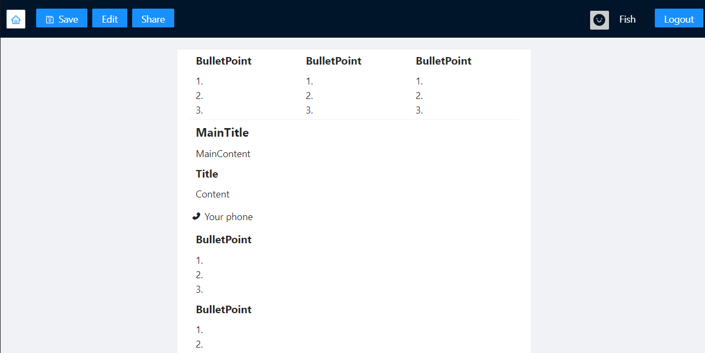

# ResuMaker
## 預覽頁面
### Home Page
<a href="https://youtu.be/tiKfVrLaVGU"></a>

### Edit Resume Page
<a href="https://youtu.be/tiKfVrLaVGU"></a>

## 介紹影片連結
也可點擊上面圖片

[https://youtu.be/tiKfVrLaVGU](https://youtu.be/tiKfVrLaVGU)

## 服務介紹
【介紹】
ResuMaker 旨在協助求職者快速打造適合自己的履歷。我們提供多樣化的區塊設計讓使用者彈性編排合適的履歷風格，並實作 UI 無差異的 Edit/View 模式讓使用者能「所見及所得」地編輯履歷。在使用者精心編撰履歷後，我們更提供履歷分享服務，讓使用者能隨心所欲地分享自己編撰的履歷給求職對象、親友過目。我們由衷期望使用者能利用 ResuMaker 順利求得理想職缺。

【使用流程】
1. 註冊
1. 登入
1. 編寫履歷
1. 新增/修改/刪除區塊
1. 儲存履歷 (請注意下面的[注意事項](#ReadMe-注意事項))
1. 預覽履歷
1. 分享履歷
1. 登出

## 執行方式

Deployed 連結：http://172.105.208.68/

### Localhost 執行方式

1. 到 `./frontend` 和 `./backend` 裡面先安裝好 npm 套件
```bash
cd frontend && yarn
cd backend && yarn
```

2. 先準備一個 monogdb 的 url 寫入 `./backend/.env`:

```
MONGO_URL=mongodb+srv://....
PORT=5000
```

3. 可以到根目錄去執行 `yarn start` 或者開兩個 console 來個別執行 `yarn start` 和 `yarn server`

```bash
yarn start

# 或者

cd frontend && yarn start
cd backend && yarn server
```

### Deploy 的改變地方

Deploy 版本的各種 IP 和 PORT 和 `localhost` 會不一樣，要跟著一下的步驟完成更改

#### 後端

- `./backend/src/server.js` 要更替origin的網址，換成實際導出的網址

```javascript=20
app.use(
  cors({
    origin: ["http://172.105.208.68"], // 這裡之後要替換成我們服務綁定的網址
    credentials: true,
  })
);
```

#### 前端

- `./frontend/src/features/resume/ResumeHeader.js` 更改原設定為`localhost` 的網域

```javascript=128
<p>{`http://172.105.208.68:80/viewResume/${sharableUrlSuffix}`}</p>
```

- `./frontend/arc/axios.js` 把網址從 `localhost` 改成實際IP和PORT

```javascript=5
baseURL: `http://172.105.208.68:5000`
```

- `./frontend/.env` 更改前端PORT

```
PORT=80
```


## 功能詳述
### 身分驗證
#### 後端
我們使用 cookie and session 的概念實作登入機制，並輔以 passport.js 套件及 express-session.js 精煉流程及程式碼。每當有一新的 client 連線至 server，server 都會派發一個 session 給該使用者，同時在回覆中加上 set-cookie 表頭在 client 的瀏覽器設定對應的 cookies。在未來，client 只要與 server 溝通時都能附加上該 cookies，server 就能成功識別該 client。

接著，若使用者連線成功，server 會在該連線 client 對應的 session 中加入使用者資料，未來只須檢視 client 的 session 是否包含用戶資料，就能知曉該 client 是否登入以及所屬帳戶為何。

值得一提的是，因為 server、client 的溝通過程涉及 cookies 的傳輸，所以需要在此前設定 CORS 的 middleware 建立白名單並允許 credentials，程式碼如下: 

```javascript=20
//in /backend/src/server.js
app.use(
  cors({
    origin: ["前端 deploy 的 IP"], // 這裡之後要替換成我們服務綁定的網址
    credentials: true,
  })
);
```

#### 前端
在 client 登入後，為了讓使用者在刷新頁面時，瀏覽器仍能直接 render 登入時的狀態。當使用者成功登入後，瀏覽器會為其設定 isLogin 的 cookies 方便 react 直接識別。此 cookies 的設計有考慮到資安隱患，不存在使用者變更該 cookies 值就能繞過登入驗證的情形，後端在辨認 client 是否登入時僅相依於 session 機制，該 cookies 的使用單純為方便 react render 前判斷用戶是否登入，舉例而言，未登入者禁止進入resume 頁面，已登入者禁止進入 register、login 頁面。

### 路由控制
#### 路由
* /: 首頁
* /login: 登入
* /register: 註冊
* /resume: 履歷製作頁
* /viewResume: 履歷分享頁

#### 重導向
* 未登入者禁止進入resume頁面
* 已登入者禁止進入 register、login 頁面。

## ReadMe: 注意事項
在儲存履歷時，不能在按下儲存後立即離開頁面，需要稍等一會兒讓程式運行。